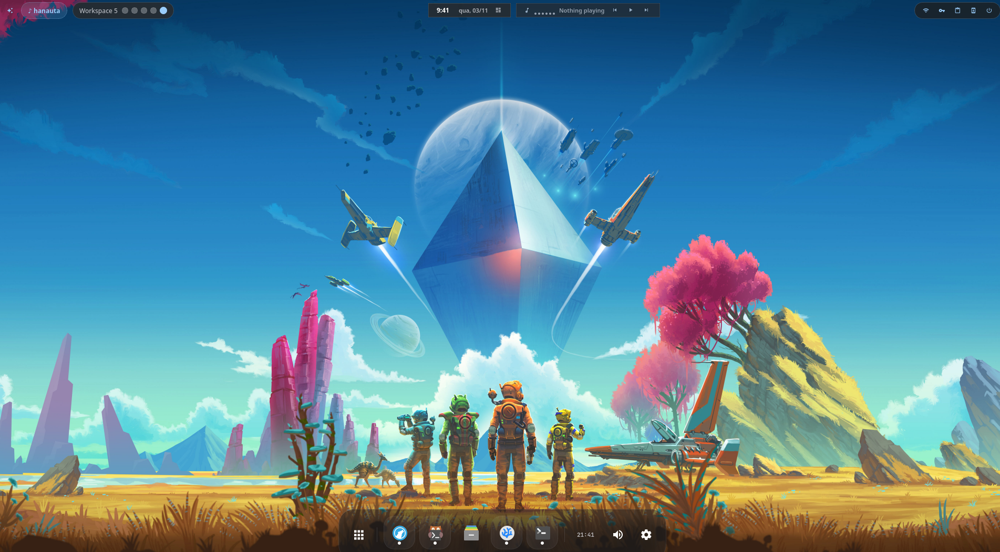
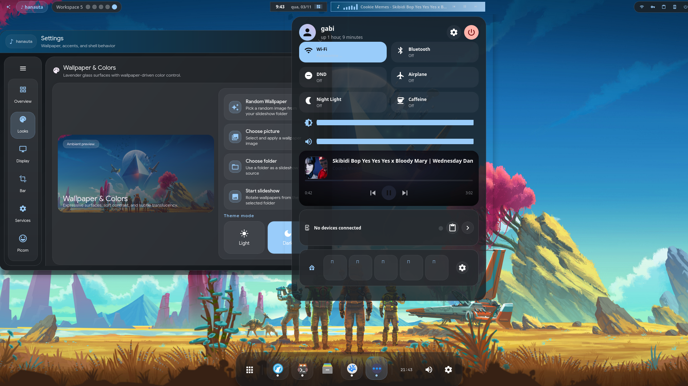
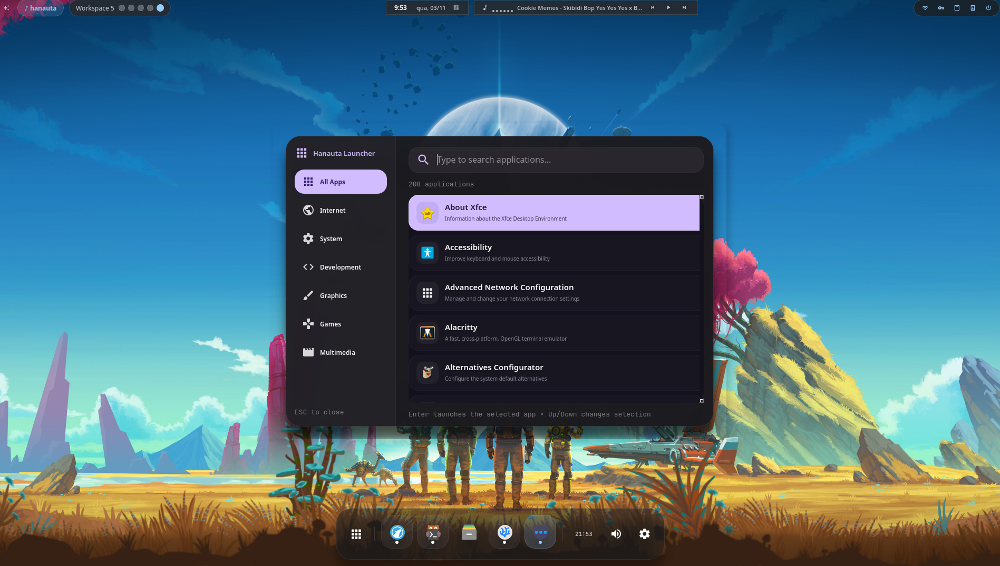
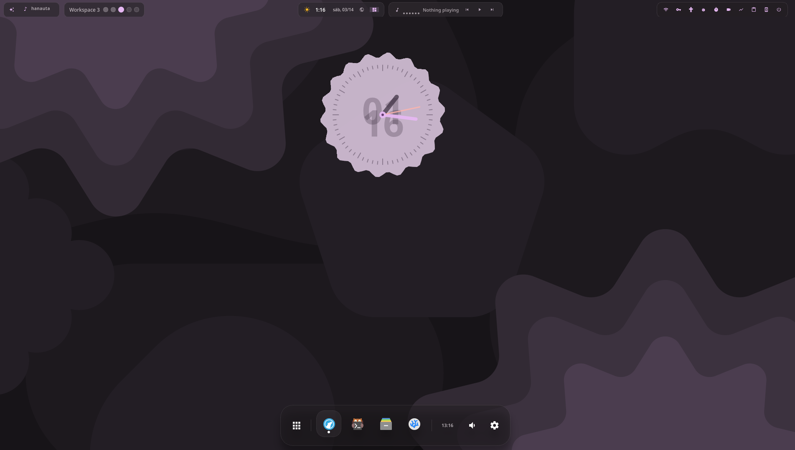

# 🌸 Hanauta

> A wallpaper-reactive desktop theme and workflow layer for **i3** on X11

Hanauta transforms your X11 desktop into a cohesive, modern experience with native **PyQt6** components. Everything—from the bar to the notification center—adapts dynamically to your wallpaper colors.

## ✨ What Makes Hanauta Special

- **🎨 Wallpaper-Reactive Theming** — Colors extracted automatically from your wallpaper via Matugen
- **🔔 Native Notification Daemon** — Full Freedesktop DBus support with notification history
- **🖥️ All-Native PyQt6 UI** — No Electron, no Eww shell—just pure Python widgets
- **🔄 Live Editor Theming** — VS Code / VSCodium matches your desktop colors in real-time

## 🚀 Features

### Core UI
- **Bar** — Workspace indicators, media player, clock, system status (battery, volume, WiFi, Bluetooth)
- **Notification Center** — Material 3 expressive layout with quick settings
- **Notification Daemon** — Native DBus implementation with notification history
- **Dock** — Elegant app dock with wallpaper-aware theming
- **Launcher** — Quick app launcher (`Super+Space`)
- **Window Switcher** — Visual window switcher (`Alt+Tab`)
- **Hotkeys Overlay** — Visual hotkeys reference (`Alt+F1`)
- **Power Menu** — Session controls (lock, logout, reboot, shutdown)

### Settings Application
- **Wallpaper & Colors** — Choose wallpapers, configure placement modes (Fill, Fit, Center, Stretch, Tile)
- **Display Management** — Multi-monitor controls, primary display, mirror/extend, orientation, refresh rate, resolution
- **Picom Compositor** — GUI for blur, shadows, fading, rounded corners
- **Bar Configuration** — Customize what's shown in the bar

### Integrations & Widgets
- **Home Assistant** — Control smart home entities directly from settings
- **VPN Control** — Manage WireGuard/OpenVPN connections
- **Weather** — Current conditions and forecasts
- **Calendar** — Events integration
- **Reminders** — Task reminders
- **Pomodoro Timer** — Focus timer with notifications
- **RSS Reader** — Follow your favorite feeds
- **Crypto Prices** — Live cryptocurrency prices (CoinGecko)
- **OBS Control** — Scene switching and streaming controls
- **VPS Monitor** — Remote server status monitoring
- **Desktop Clock** — Floating clock widget
- **Game Mode** — Gaming mode toggle with Lutris/Steam integration
- **NTFY Support** — Push notification integration

### Desktop Features
- **Wallpaper Source Sync** — Presets for Caelestia and End-4 wallpaper packs
- **Per-Monitor Wallpaper** — Different wallpapers per display
- **Live Editor Theming** — VS Code / VSCodium workbench matches wallpaper colors

### Systray
- **Native StatusNotifier tray** — The PyQt bar hosts modern DBus tray items directly
- **Fallback watcher support** — Hanauta starts its own watcher helper when the session does not provide `org.kde.StatusNotifierWatcher`
- **Works with mixed tray apps** — Supports apps that expose either `IconName` or raw `IconPixmap`
- **Theme-aware tray styling** — Tray icons can be tinted with the live Matugen primary color
- **Dedicated alignment control** — Tray icons have their own vertical offset setting instead of sharing the whole status block offset

## 📸 Screenshots




Hyprland's clock successfully ported:


## ⌨️ Hotkeys

| Shortcut | Action |
|----------|--------|
| `Super+Return` | Open terminal (kitty) |
| `Super+Space` | Open launcher |
| `Alt+F1` | Hotkeys overlay |
| `Alt+Tab` | Window switcher |
| `Print` | Screenshot (Flameshot) |
| `Super+Q` | Close window |
| `Super+H/J/K/L` | Focus windows |
| `Super+Shift+H/J/K/L` | Move windows |
| `Super+1..5` | Switch workspaces |
| `Super+Shift+1..5` | Move window to workspace |
| `Super+V` | Vertical split |
| `Super+B` | Horizontal split |
| `Super+F` | Toggle fullscreen |
| `Super+L` | Lock session |
| `Super+Shift+C` | Reload i3 |
| `Super+Shift+R` | Restart i3 |

## 🏗️ Architecture

### Core Components
- **Bar**: `hanauta/src/pyqt/bar/ui_bar.py`
- **Notification Center**: `hanauta/src/pyqt/notification-center/notification_center.py`
- **Notification Daemon**: `hanauta/src/pyqt/notification-daemon/notification_daemon.py`
- **Settings App**: `hanauta/src/pyqt/settings-page/settings.py`
- **Shared Theme Logic**: `hanauta/src/pyqt/shared/theme.py`
- **VS Code Extension**: `hanauta/vscode-wallpaper-theme/`

### Theming Pipeline

```
Wallpaper → Matugen → Palette JSON → PyQt UI + VS Code
```

1. Select a wallpaper in settings
2. Matugen extracts a color palette
3. Palette written to `~/.local/state/hanauta/theme/pyqt_palette.json`
4. All PyQt surfaces (bar, dock, notification center) restyle live
5. VS Code extension watches the same file and updates the editor

## Systray Support

Hanauta's active systray lives in the PyQt bar at `hanauta/src/pyqt/bar/ui_bar.py`.

- It uses the StatusNotifierItem / StatusNotifierWatcher DBus model
- It does not use Eww systray widgets
- It does not depend on `stalonetray` as the normal tray host
- If no watcher is present on the session bus, the bar launches `hanauta/src/pyqt/bar/status_notifier_watcher.py`

The current implementation is based on what works reliably in this environment:

- Read watcher properties and tray item properties through `org.freedesktop.DBus.Properties.Get`
- Accept tray apps that register with only an object path and normalize those registrations in the fallback watcher
- Use real global pointer coordinates for `Activate`, `SecondaryActivate`, and `ContextMenu`
- Keep tray startup visibility independent from whether the parent bar is already shown
- Support both theme icons and raw pixmap icons
- Apply optional tray tinting from the live Matugen palette when Matugen is enabled

After systray code changes, restart the bar fully so tray apps can re-register cleanly:

```bash
pkill -f 'hanauta/src/pyqt/bar/ui_bar.py|hanauta-bar'
python hanauta/src/pyqt/bar/ui_bar.py
```

## Why PyQt6 Stayed

Hanauta briefly tested a native C++/QML path for the dock, Wi-Fi popup, and notification center. On this machine, those experiments were consistently slower and heavier than the existing PyQt6 widgets, so the desktop stayed on PyQt6 as the active UI stack.

The repository also tested compiling the PyQt shell with Nuitka. That path is only partially active today:

- `bar` and `dock` currently run from Python source
- many secondary widgets/popups still run from Nuitka binaries in `hanauta/bin`

This hybrid setup is intentional. In this environment, the compiled `hanauta-bar` and `hanauta-dock` hit click/input regressions, while compiled secondary widgets were still usable. Until those shell-specific issues are solved, the default setup keeps the top-level shell on Python and uses Nuitka for many supporting widgets.

Measured locally during the switch-back:

| Widget | PyQt6 widgets | C++/QML | Difference |
|--------|----------------|---------|------------|
| Wi-Fi control | `0.200s` startup, `76.6 MB RSS`, `35.8 MB PSS` | `0.613s` startup, `137.7 MB RSS`, `67.2 MB PSS` | C++/QML opened slower and used much more memory |
| Notification center | `0.761s` startup, `98.9 MB RSS`, `52.7 MB PSS` | `1.116s` startup, `159.7 MB RSS`, `86.0 MB PSS` | C++/QML was slower and heavier |
| Dock | `79.5 MB RSS`, `37.7 MB PSS` | `127.3 MB RSS`, `64.5 MB PSS` | C++/QML used much more memory |

PyQt6 with classic widgets also beat a PyQt6+QML Wi-Fi popup rewrite:

| Wi-Fi popup variant | Startup | RSS | PSS |
|---------------------|---------|-----|-----|
| PyQt6 widgets | `0.200s` | `76.6 MB` | `35.8 MB` |
| PyQt6 + QML frontend | `0.778s` | `160.1 MB` | `91.1 MB` |

Because of those results, the repository keeps PyQt6 widgets as the active desktop UI and archives the Qt/QML native widget experiments instead of shipping them as defaults.

## 📁 Project Structure

```
├── config/              # i3 configuration
├── picom.conf          # Compositor settings
├── assets/             # Fonts and media
├── hanauta/
│   ├── src/pyqt/      # Active desktop UI
│   │   ├── bar/               # Top bar
│   │   ├── notification-center/   # Notification center
│   │   ├── notification-daemon/   # DBus notification daemon
│   │   ├── settings-page/     # Settings app
│   │   ├── dock/              # App dock
│   │   ├── launcher/          # App launcher
│   │   ├── widget-*/          # Various widgets
│   │   └── shared/            # Shared utilities
│   ├── src/service/      # Native C background services
│   │   ├── hanauta-service.c
│   │   ├── hanauta-notifyctl.c
│   │   ├── hanauta-notifyd.c
│   │   └── archive/qt-qml-experiments/  # Archived Qt/QML widget experiments
│   ├── scripts/          # Helper scripts (moved from eww)
│   └── vscode-wallpaper-theme/  # Editor theming
└── install.sh          # Installation script
```

## 🛠️ Installation

### Full Desktop Setup
```bash
./install.sh
```

### Editor Theme Only
```bash
./install.sh --vscode    # VS Code
./install.sh --vscodium  # VSCodium
```

### Rebuild Popup Binaries
```bash
./hanauta/build-popup-widgets.sh
```

That rebuilds the compiled Nuitka popup/widget binaries that the Python bar prefers through `hanauta/bin`, with a simple per-target progress bar. You can also rebuild a subset, for example:

```bash
./hanauta/build-popup-widgets.sh hanauta-wifi-control hanauta-vpn-control hanauta-game-mode-popup
```

## 📚 Credits & Inspiration

- [dms-plugins](https://github.com/AvengeMedia/dms-plugins)
- [nucleus-shell](https://github.com/xZepyx/nucleus-shell)
- [caelestia shell](https://github.com/caelestia-dots/shell)
- [end-4 dots-hyprland](https://github.com/end-4/dots-hyprland)
- [FreshRSS](https://FreshRSS.github.io/FreshRSS/en/)
- [CoinGecko API](https://docs.coingecko.com/)
- RSS widget adaptation based on [BrendonJL's dms-rss-widget](https://github.com/BrendonJL/dms-rss-widget)

---

Built with ❤️ for the X11/Linux desktop community
